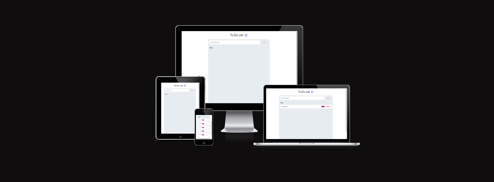

# To-Do List

Welcome to our To-Do List Manager! This application is designed to help you stay organized and boost your productivity. Create and manage your tasks, set priorities, and enjoy the satisfaction of deleting them off as you complete them. It's a simple yet effective way to keep track of your daily responsibilities and achieve your goals.

## **Table of Contents**

1. [UX Development](#ux-development)

* [DESIGN](#design)
    * [Colour Scheme](#colour-scheme)
    * [Typography](#typography)
    * [Wireframes](#wireframes)

2. [Features](#features)  
    
    * [General Features On The To-Do List Page](#general-features-on-the-to-do-page)

3. [Testing](#testing)
    * [TESTING.md](#testing)

4. [Deployment](#deployment)  
    * [Deployment Github Pages](#deployment-to-github-pages)
    * [Steps To Use This Project](#steps-to-use-this-project)  

5. [Credits](#credits)  
    * [Content](#content)
    * [Media](#media)

6. [Technology Used](#technology-used)  
    * [Language Used](#language-used)