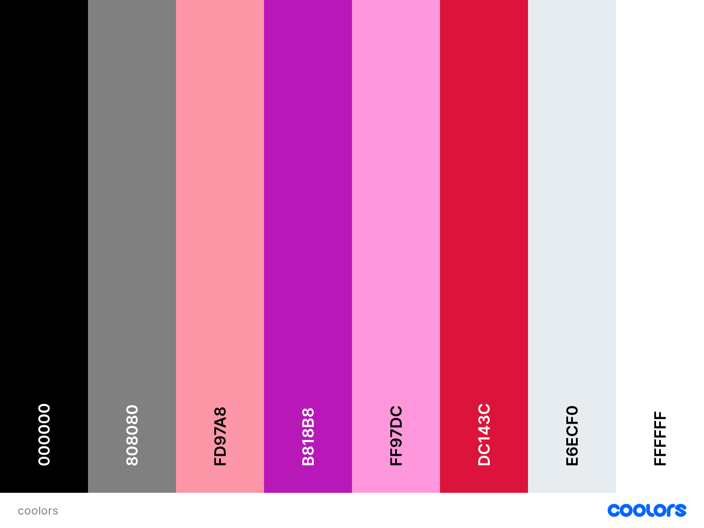
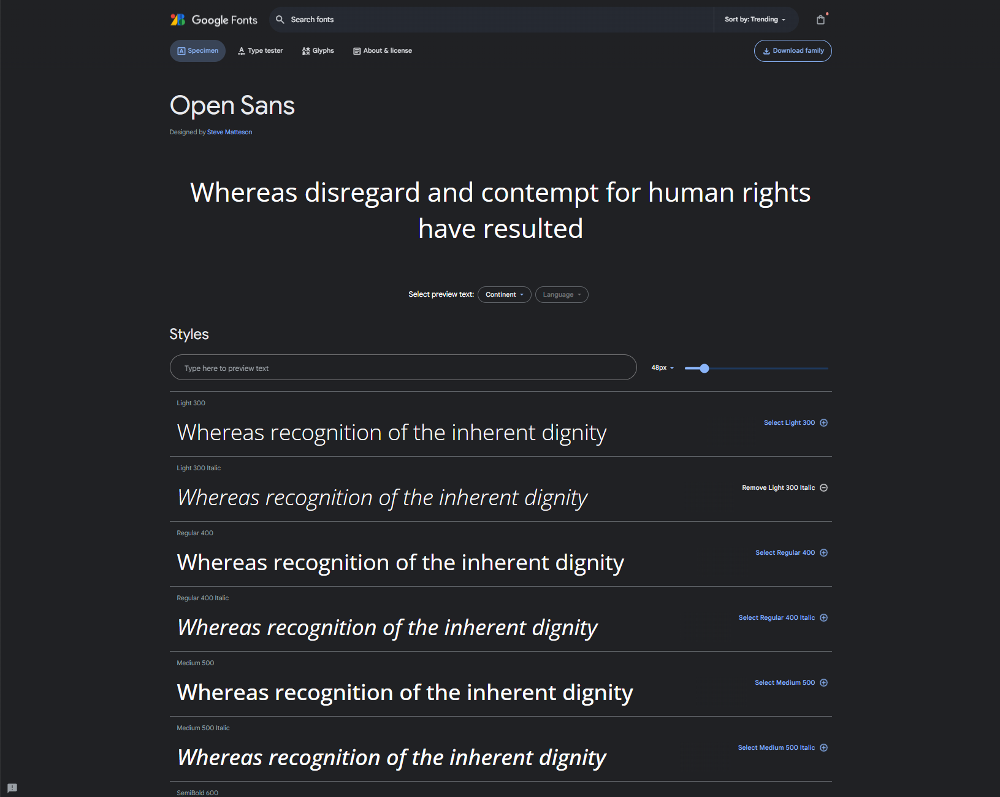
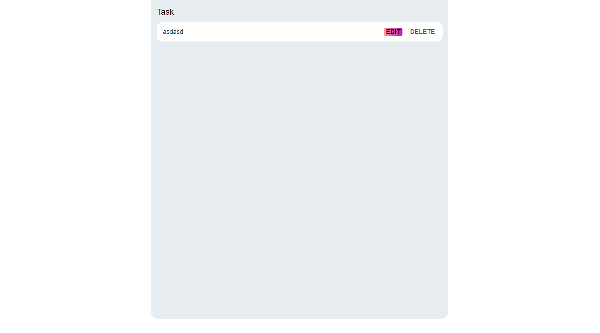

# To-Do List

Welcome to our To-Do List Manager! This application is designed to help you stay organized and boost your productivity. Create and manage your tasks, set priorities, and enjoy the satisfaction of deleting them off as you complete them. It's a simple yet effective way to keep track of your daily responsibilities and achieve your goals.

## **Table of Contents**

1. [UX Development](#ux-development)

* [DESIGN](#design)
    * [Colour Scheme](#colour-scheme)
    * [Typography](#typography)
    * [Wireframes](#wireframes)

2. [Features](#features)  
    
    * [General Features On The To-Do List Page](#general-features-on-the-to-do-page)

3. [Testing](#testing)
    * [TESTING.md](#testing)

4. [Deployment](#deployment)  
    * [Deployment Github Pages](#deployment-to-github-pages)
    * [Steps To Use This Project](#steps-to-use-this-project)  

5. [Credits](#credits)  
    * [Content](#content)
    * [Media](#media)

6. [Technology Used](#technology-used)  
    * [Language Used](#language-used)
    * [Deployment](#deployment)

    ## **UX Development**

## **Design**

### **Colour Scheme**

The selected color scheme was thoughtfully chosen to convey a distinct visual identity that aligns with the project's overall design philosophy, creating a cohesive and engaging user experience.

### **Typography**

As the main focus of the site is the messages that people are sending, I have only used one font throughout the site to prevent users becoming overwhelmed.

Fira sans was imported from google fonts. It is a sans-serif font which is accessible friendly.

### **Wireframes**

The entire site's wireframe was done using [mockflow wireframes](https://www.mockflow.com/).This depicts the site on a desktop and a mobile device.

[To Do List Without Tasks Wireframes](assets/images/To-Do-List-Without-Tasks-Wireframes.png)

[To Do List With Tasks Wireframes](assets/images/To-Do-List-With-Tasks-Wireframes.png)

---

## Features

### **General Features On The To-Do List Page**

The site has been designed to be fully responsive, from mobile all the way up to desktop.

- __Header__

- This section contains the name and the icon of the To-Do List website.

- __Input and Submit Section__

- This section contains a placeholder for users to type what they want to add to the To-Do list .

- And it also contains a submit button when added text into the placeholder and press add it will add it to the To-Do list.

- __Task List Section__

- This section contains where added tasks will be displayed.

- And also contains two buttons that allows users to edit and delete content.

---

## Testing

Please view our [TESTING.md](TESTING.md) file for more information on the testing undertaken.

---

## Credits 

### Content

- Fonts for this project were used from [Google fonts](https://fonts.google.com/).

### Media

- The photos for the Favicon and icon in the header are from This Open Source site  [icons8](https://icons8.com/).

---

## **Technology Used**

### **Language Used**

HTML, CSS, Javascript.

* [mockflow wireframes](https://www.mockflow.com/) - To create wireframes.

* [Git](https://git-scm.com/) - For version control.

* [Github](https://github.com/)- To save and store the files for the website and for deployment.

* [Google DevTools](https://developers.google.com/web/tools) - To troubleshoot and test features, solve issues with responsiveness and styling.

* [Am I Responsive?](http://ami.responsivedesign.is/) To show the website image on a range of devices.

* [Google fonts](https://fonts.google.com/) - used to import the font used on the site.

## Deployment

- The site was deployed to GitHub pages. The steps to deploy are as follows: 
  - In the GitHub repository, navigate to the Settings tab .
  - From the source section drop-down menu, select the Master Branch.
  - Once the master branch has been selected, the page will be automatically refreshed with a detailed ribbon display to indicate the successful deployment. 

The live link can be found here - https://david011e.github.io/To-Do-List/